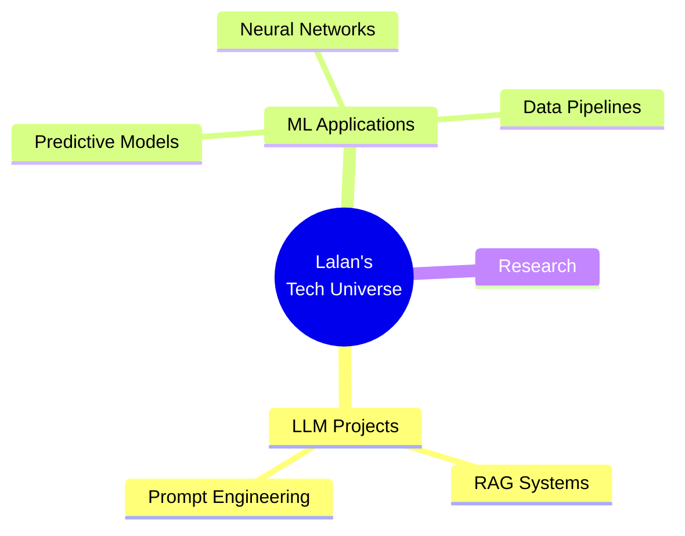

<div align="center">

<!-- Animated Header -->


<!-- Dynamic Typing -->
[](https://git.io/hihihi-svg)

<!-- Badges -->
<p align="center">
  
  <a href="https://github.com/hihihi-svg">
    
  </a>
  <a href="lalanpradeep26@gmail.com">
    
  </a>
</p>

</div>

---


## 🧬 Who Am I?

```python
class Lalan:
    def __init__(self):
        self.location = "R. V. College of Engineering, Bangalore"
        self.focus = ["Machine Learning", "LLMs", "RAG Systems"]
        self.current_mission = "Bridging the gap between AI research and real-world impact"
        
    def expertise(self):
        return {
            "ai_ml": ["TensorFlow", "Scikit-learn", "Deep Learning"],
            "llm_stack": ["LangChain", "LangGraph", "RAG Pipelines"],
            "languages": ["Python", "C++", "C", "HTML"],
            "mindset": "Ship fast, iterate faster"
        }
    
    def philosophy(self):
        return "Every line of code is a step towards making AI accessible to everyone"

# Initialize
me = Lalan()
print(me.expertise())
```

<div align="center">
  
</div>

---

## 🛠️ Tech Arsenal

<div align="center">

### 💻 Core Languages


### 🤖 AI/ML Stack


### 🔥 Specializations
<<table>
<tr>
<td align="center" width="120">

<br><b>LLM Engineering</b>
</td>

<td align="center" width="120">

<br><b>RAG Systems</b>
</td>

<td align="center" width="120">

<br><b>Neural Networks</b>
</td>

<td align="center" width="120">

<br><b>ML Pipelines</b>
</td>
</tr>
</table>


</div>

---

## 🚀 What I'm Building

<div align="center">



</div>

### 🎯 Current Focus

<table>
<tr>
<td width="50%">

#### 📚 Learning Journey
- ### 🧩 Advanced AI & Full-Stack Capabilities

- 🧠 Advanced **LangGraph architectures**  
- ⚡ Production-grade **RAG optimization**  
- 🔬 Deep dive into **Transformer model internals**  
- 🎨 **Prompt engineering** mastery  
- 🐳 **MLOps** & deployment strategies  
- 🌐 **Full-Stack Development** for AI apps (React + Flask)  
- ☁️ **Cloud deployment** on AWS, Render, and Hugging Face Spaces  
- 🧰 **CI/CD workflows** with Docker & GitHub Actions  

</td>
<td width="50%">

#### 🔨 Building Next
- 🤖 **Intelligent RAG system** with multi-modal retrieval
- 💬 **LangGraph agent** for complex workflows
- 📊 **ML pipeline** for real-time predictions
- 🎯 **Custom LLM fine-tuning** framework
- 🌐 **AI-powered web application**

</td>
</tr>
</table>

---

## 📊 GitHub Analytics

<div align="center">


</div>

## 🐍 Watch my contributions get eaten by a snake!

---

## 🏆 Achievement Vault

<div align="center">


</div>

<table align="center">
<tr>
<td align="center">🎓</td>
<td><b>Academic Excellence</b></td>
<td>Passed with 8.6 cgpa in First Year</td>
</tr>
<tr>
<td align="center">🤖</td>
<td><b>AI/ML Specialist</b></td>
<td>TensorFlow • LangChain • RAG Expert</td>
</tr>
<tr>
<td align="center">💡</td>
<td><b>Problem Solver</b></td>
<td>Turning complex challenges into elegant code</td>
</tr>
<tr>
<td align="center">🌱</td>
<td><b>Continuous Learner</b></td>
<td>Always exploring the bleeding edge of AI</td>
</tr>
</table>

---
---

## 💭 Philosophy

<div align="center">

> *"The best way to predict the future is to build it with AI"*


</div>

---

## 🤝 Let's Connect & Collaborate

<div align="center">

I'm always excited to collaborate on **AI/ML projects**, **LLM applications**, and **innovative research**!

### 📬 Reach Out

<a href="https://www.linkedin.com/in/lalan-pradeep-7386aa300?utm_source=share_via&utm_content=profile&utm_medium=member_android">
  
</a>
<a href="lalanpradeep26@gmail.com">
  
</a>


</div>

---

<div align="center">

### 🎯 Quick Stats


**💼 Open to:** Research Collaborations • Deep Learning Projects • LLM Consulting • Open Source Contributions

**🌟 Interests:** Large Language Models • Retrieval Augmented Generation • Neural Architecture • AI Agents

</div>

---


<div align="center">

**⭐ If you find my work interesting, consider leaving a star! ⭐**


*"Building the future, one commit at a time"* 🚀

</div>